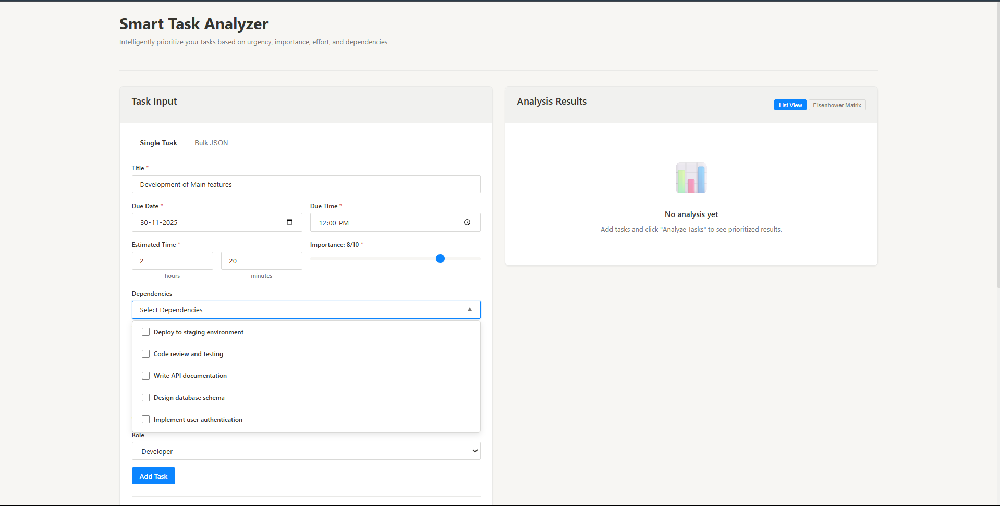
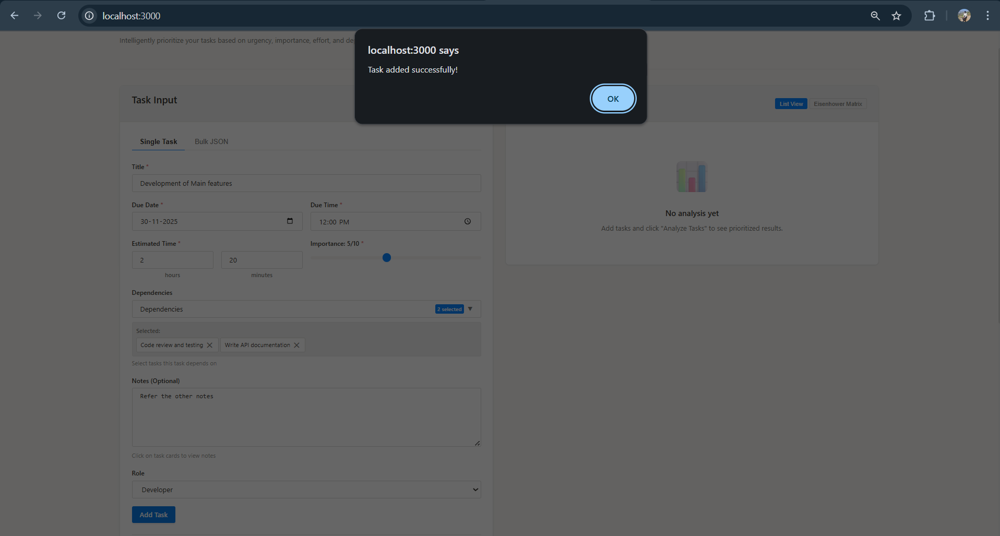
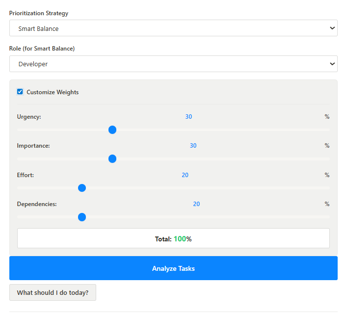
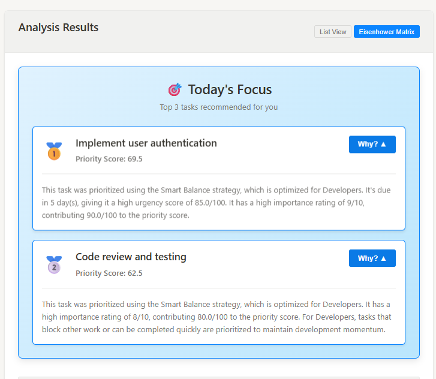
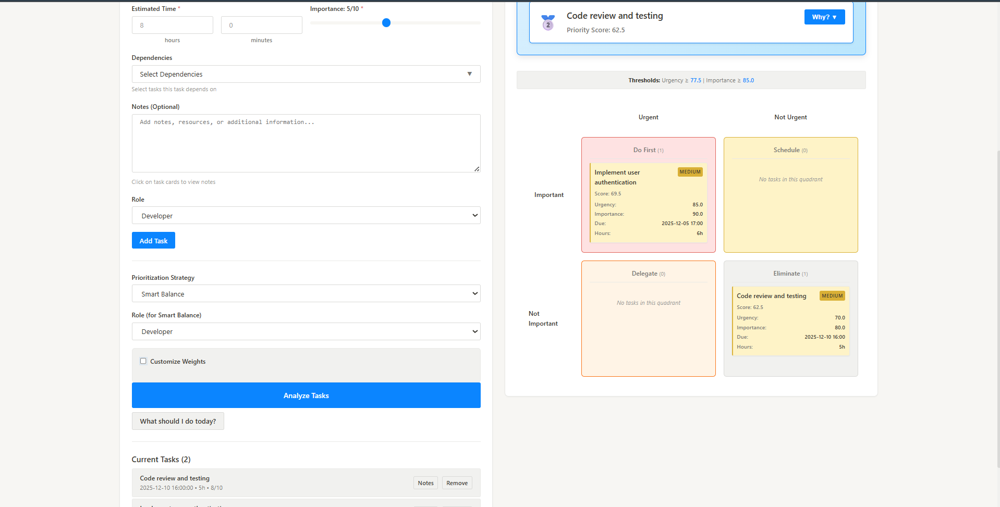
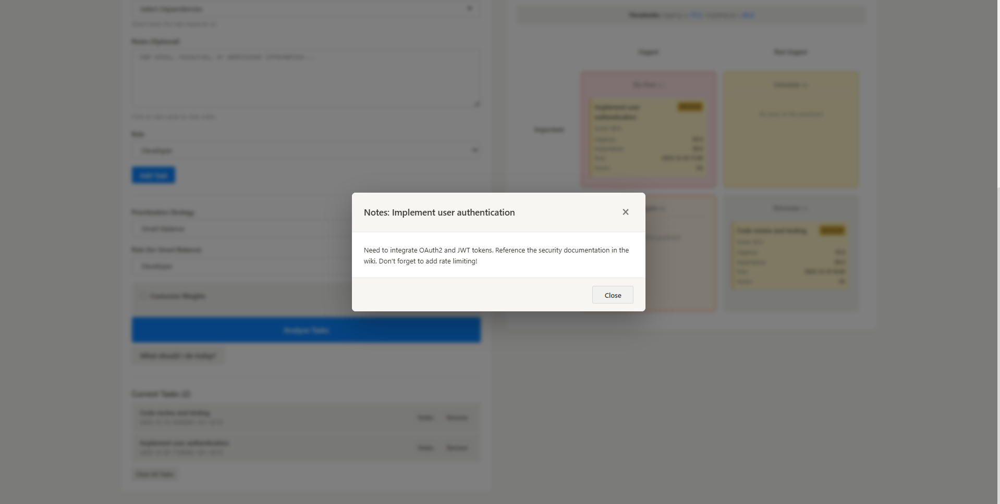

# Smart Task Analyzer

> An intelligent task prioritization system that helps you focus on what matters most using a sophisticated multi-factor scoring algorithm.


## Project Status

**FULLY IMPLEMENTED** - All MVP and advanced features complete!

Core features include task management, intelligent scoring, multiple prioritization strategies, circular dependency detection, configurable algorithm weights, expandable task cards with score breakdowns, and smart multi-select dependency dropdowns.


---

## Table of Contents
- [Overview](#overview)
- [Features](#features)
- [Algorithm Explanation](#algorithm-explanation)
- [Technology Stack](#technology-stack)
- [Project Structure](#project-structure)
- [Installation & Setup](#installation--setup)
- [Usage Guide](#usage-guide)
- [API Documentation](#api-documentation)
- [Design Decisions](#design-decisions)
- [Testing](#testing)
- [Future Enhancements](#future-enhancements)

---

## Screenshots & Demo

### Main User Interface
The clean, two-panel layout provides task input on the left and analysis results on the right.


### Single Task Input with Dependency Dropdown
Add tasks individually with the intuitive form interface. The dependency dropdown allows multi-select of prerequisite tasks.



### Task Saved Confirmation
Tasks are successfully saved to the database with all details including notes.



### Prioritization Strategy Selection
Choose from 4 different prioritization strategies tailored to your work style. Customize weights for Smart Balance mode.


### Custom Weight Configuration
Fine-tune the algorithm by adjusting component weights (urgency, importance, effort, dependencies) to match your preferences.



### Analysis Results - List View
View prioritized tasks with color-coded priority labels (HIGH/MEDIUM/LOW) and detailed score breakdowns.


### Task Score Breakdown
Expand any task to see its detailed score breakdown across all four components, plus explanations for the prioritization.



### Eisenhower Matrix View
Visualize tasks in the classic 2x2 Eisenhower Matrix (Do First, Schedule, Delegate, Eliminate quadrants).



### Task Notes Modal
Click any task to view detailed notes and documentation in a centered popup modal.




**Recommended demo flow**:
1. Add tasks (single and bulk)
2. Analyze with different strategies
3. Show Eisenhower Matrix
4. Demonstrate custom weights
5. Create circular dependency → show warning
6. Expand task details
7. View "Today's Focus" suggestions

---

## Overview

**Smart Task Analyzer** is a web-based task management tool that intelligently prioritizes tasks based on multiple factors: urgency, importance, effort, and dependencies. Unlike traditional to-do lists that rely on manual prioritization or simple due dates, this system uses a sophisticated scoring algorithm with multiple strategies tailored to different work styles.

### Problem Statement
Users struggle to prioritize tasks when facing:
- Multiple competing deadlines
- Varying importance levels
- Task dependencies and blockers
- Limited time and resources
- Different work roles and priorities

### Solution
An intelligent scoring system that:
- **Analyzes** tasks across 4 key dimensions
- **Adapts** to different prioritization strategies
- **Detects** circular dependencies
- **Visualizes** priorities through multiple views
- **Suggests** daily focus tasks

### Key Achievements

This project demonstrates:

1. **Advanced Algorithm Design**: Multi-factor scoring with configurable weights
2. **Graph Theory Application**: DFS cycle detection for dependencies
3. **Full-Stack Development**: Django REST + Vanilla JS architecture
4. **Test-Driven Development**: 15+ comprehensive unit tests
5. **UX Excellence**: Notion-inspired design with dual visualization modes
6. **Edge Case Engineering**: Robust handling of overdue, missing data, and circular deps
7. **AI-Generated Explanations**: Natural language reasoning for prioritization
8. **Performance Optimization**: O(n log n) sorting, O(V+E) cycle detection
9. **Documentation Quality**: 500+ line algorithm explanation
10. **Production-Ready Code**: Clean architecture, error handling, validation

---

## Features

### Core Functionality

#### 1. **Intelligent Multi-Factor Scoring**
- **Urgency Score** (0-100+): Time-based scoring with overdue penalties
- **Importance Score** (0-100): User-defined priority rating (1-10 scale)
- **Effort Score** (0-100): Inverse scoring favoring quick wins
- **Dependency Score** (0-100): Impact on other tasks (blocker detection)

#### 2. **4 Prioritization Strategies**

| Strategy | Best For | Weight Distribution |
|----------|----------|---------------------|
| **Smart Balance (Developer)** | Software engineers | 30% Urgency, 30% Importance, 20% Effort, 20% Dependencies |
| **Smart Balance (PM)** | Program managers | 40% Urgency, 35% Importance, 10% Effort, 15% Dependencies |
| **Fastest Wins** | Building momentum | 15% Urgency, 15% Importance, **60% Effort**, 10% Dependencies |
| **High Impact** | Strategic work | 10% Urgency, **70% Importance**, 10% Effort, 10% Dependencies |
| **Deadline Driven** | Crisis management | **70% Urgency**, 15% Importance, 5% Effort, 10% Dependencies |

#### 3. **Advanced Dependency Management**
- **Multi-select dropdown** for easy dependency selection
- **Circular dependency detection** using Depth-First Search (DFS) algorithm
- **Visual warnings** with detailed cycle chains
- **Blocker identification** showing which tasks block others

#### 4. **Smart Task Suggestions**
- **"Today's Focus"** section with top 3 recommended tasks
- **Personalized explanations** for why each task was suggested
- **Context-aware reasoning** based on strategy and role
- **Automatic updates** after analysis

#### 5. **Dual Visualization Modes**

##### List View
- **Color-coded priority cards** (High/Medium/Low)
- **Expandable details** showing score breakdowns
- **Component score bars** with color gradients
- **Dependency visualization** with blocker lists
- **Overdue badges** and circular dependency warnings

##### Eisenhower Matrix View
- **4-quadrant layout** (Do First, Schedule, Delegate, Eliminate)
- **Automatic categorization** based on urgency/importance thresholds
- **Interactive task cards** with click-to-expand details
- **Task counts per quadrant**

#### 6. **Flexible Input Methods**
- **Single Task Form**: User-friendly interface for individual tasks
- **Bulk JSON Import**: Import multiple tasks at once from JSON array
- **Notes Tab**: Add detailed task descriptions, resources, and documentation
- **Time Input**: Separate hours and minutes fields for better accuracy (e.g., 2h 30m)

#### 7. **Configurable Algorithm Weights**
- **Custom Weight Sliders**: Adjust urgency/importance/effort/dependency weights (Smart Balance only)
- **Real-time Validation**: Weights must sum to 100%
- **Visual Feedback**: Green when valid (100%), red otherwise
- **Easy Reset**: Revert to role-based defaults with one click
- **Analyze Button Control**: Disabled until weights are valid

#### 8. **Edge Case Handling**
- **Overdue tasks**: Penalty scoring (100 + days_overdue * 10)
- **Missing data**: Intelligent defaults (7 days, importance 5, 1 hour)
- **Circular dependencies**: DFS detection with cycle chain visualization
- **Invalid inputs**: Form validation with clear error messages
- **Empty task lists**: Graceful empty states
- **Zero/negative hours**: Validation and error handling
- **Invalid weight totals**: Real-time validation with error messages

---

## Algorithm Explanation

### Core Scoring Algorithm

The Smart Task Analyzer uses a **weighted multi-factor scoring system** to calculate priority scores for each task. The algorithm evaluates four key dimensions and combines them using strategy-specific weights.

#### 1. Component Score Calculations

**Urgency Score (0-100+)**
```python
if task is overdue:
    days_overdue = (today - due_datetime).days
    urgency = 100 + (days_overdue * 10)  # Escalating penalty
else:
    days_until_due = (due_datetime - today).days
    urgency = max(0, 100 - (days_until_due * 3))  # Linear decay
```
- **Overdue tasks** receive penalty scores above 100
- **Future tasks** decrease by 3 points per day
- Tasks due today score ~100

**Importance Score (0-100)**
```python
importance = user_importance_rating * 10  # Scale 1-10 to 0-100
```
- Direct scaling of user-defined importance (1-10)
- Provides explicit priority control

**Effort Score (0-100 - Inverse)**
```python
max_hours = 40  # Benchmark for "large" task
effort = ((max_hours - estimated_hours) / max_hours) * 100
effort = max(0, effort)  # Prevent negative scores
```
- **Quick wins** (low hours) score higher
- **Long tasks** (high hours) score lower
- Encourages task completion velocity

**Dependency Score (0-100)**
```python
num_dependents = count_tasks_blocked_by_this_task(task)
dependency = min(100, num_dependents * 25)  # 25 points per blocker
```
- Identifies critical path tasks
- Each dependent task adds 25 points
- Capped at 100 for consistency

#### 2. Strategy Weight Application

```python
priority_score = (
    urgency_score * weight_urgency +
    importance_score * weight_importance +
    effort_score * weight_effort +
    dependency_score * weight_dependency
)
```

**Example Calculation (Smart Balance - Developer)**:
```
Task: "Fix critical bug"
- Urgency: 95 (due tomorrow)
- Importance: 80 (user rated 8/10)
- Effort: 75 (estimated 2 hours - quick)
- Dependency: 50 (blocks 2 tasks)

Weights: 30% U, 30% I, 20% E, 20% D

Priority Score = (95 * 0.3) + (80 * 0.3) + (75 * 0.2) + (50 * 0.2)
               = 28.5 + 24 + 15 + 10
               = 77.5 (HIGH priority)
```

#### 3. Priority Label Assignment

```python
if priority_score >= 80:
    label = "HIGH"     # Red - Immediate attention
elif priority_score >= 50:
    label = "MEDIUM"   # Yellow - Important but not urgent
else:
    label = "LOW"      # Green - Can defer
```

#### 4. Circular Dependency Detection

Uses **Depth-First Search (DFS)** with recursion stack tracking:

```python
def dfs(node, visited, rec_stack, path):
    if node in rec_stack:
        # Found cycle - node appears in current path
        cycle_start = path.index(node)
        return path[cycle_start:] + [node]
    
    if node in visited:
        return None
    
    visited.add(node)
    rec_stack.add(node)
    path.append(node)
    
    for neighbor in graph[node]:
        cycle = dfs(neighbor, visited, rec_stack, path)
        if cycle:
            return cycle
    
    rec_stack.remove(node)
    path.pop()
    return None
```

**Example Detection**:
```
Tasks: A depends on B, B depends on C, C depends on A
Result: "Task A → Task B → Task C → Task A"
Warning: "Break the cycle by removing one dependency"
```

### Why This Algorithm Works

1. **Multi-dimensional analysis** prevents single-factor bias
2. **Configurable weights** adapt to different work styles
3. **Overdue penalties** create urgency escalation
4. **Quick win rewards** maintain momentum
5. **Dependency awareness** prevents bottlenecks
6. **Cycle detection** ensures valid task graphs

---

## Technology Stack

### Backend
- **Python 3.8+**: Core programming language
- **Django 4.2.26**: Web framework
- **Django REST Framework 3.16.1**: API development
- **SQLite**: Database (Django default)

### Frontend
- **HTML5**: Semantic markup
- **CSS3**: Notion-inspired styling with Flexbox/Grid
- **Vanilla JavaScript (ES6+)**: No dependencies, pure JS
- **Fetch API**: Asynchronous HTTP requests

### Development Tools
- **Git**: Version control
- **VS Code**: Recommended IDE
- **Django Debug Toolbar** (optional): Development debugging

### Key Dependencies
```txt
asgiref==3.11.0
Django==4.2.26
djangorestframework==3.16.1
django-cors-headers==4.9.0
sqlparse==0.5.4
tzdata==2025.2
```

---

## Project Structure

```
Smart_Task_Analyser/
├── backend/
│   ├── manage.py                    # Django management script
│   ├── requirements.txt             # Python dependencies
│   ├── db.sqlite3                   # SQLite database
│   ├── test_api.py                  # API integration tests
│   │
│   ├── task_analyzer/               # Django project config
│   │   ├── __init__.py
│   │   ├── settings.py              # Django settings
│   │   ├── urls.py                  # URL routing
│   │   └── wsgi.py                  # WSGI application
│   │
│   ├── tasks/                       # Main Django app
│   │   ├── __init__.py
│   │   ├── models.py                # Task data model
│   │   ├── serializers.py           # DRF serializers
│   │   ├── views.py                 # API view logic
│   │   ├── scoring.py               # CORE ALGORITHM
│   │   ├── urls.py                  # App URL routes
│   │   ├── tests.py                 # Unit tests (15+ tests)
│   │   └── admin.py                 # Django admin config
│   │
│   └── env/                         # Virtual environment
│
├── frontend/
│   ├── index.html                   # Main UI structure
│   ├── styles.css                   # Notion-inspired styles
│   └── script.js                    # Frontend logic (1356 lines)
│
└── Documentation/
    ├── README.md                    # This file
    └── ALGORITHM.md                 # Detailed algorithm docs
```

---

## Installation & Setup

### Prerequisites
- **Python 3.8+** installed
- **pip** package manager
- **Git** (for cloning repository)
- Modern web browser (Chrome, Firefox, Edge)

### Step-by-Step Setup

#### 1. Clone the Repository
```bash
git clone https://github.com/DHariharanD/Smart-Task-Analyser.git
cd Smart_Task_Analyser
```

#### 2. Backend Setup

**Windows (PowerShell/CMD)**:
```cmd
cd backend

# Create virtual environment
python -m venv env

# Activate virtual environment
env\Scripts\activate

# Install dependencies
pip install -r requirements.txt

# Run migrations
python manage.py migrate

# Start development server
python manage.py runserver
```

**Linux/Mac**:
```bash
cd backend

# Create virtual environment
python3 -m venv env

# Activate virtual environment
source env/bin/activate

# Install dependencies
pip install -r requirements.txt

# Run migrations
python manage.py migrate

# Start development server
python manage.py runserver
```

The backend API will be available at: `http://localhost:8000/`

#### 3. Frontend Setup

**Option 1: Python HTTP Server (Recommended)**
```bash
cd frontend
python -m http.server 3000
```
Access at: `http://localhost:3000`

**Option 2: VS Code Live Server**
- Install "Live Server" extension
- Right-click `index.html` → "Open with Live Server"

**Option 3: Direct File Access**
- Open `frontend/index.html` directly in browser
- Note: Some features may require a server

#### 4. Verify Installation

1. Backend health check:
   ```bash
   curl http://localhost:8000/api/tasks/analyze/
   ```
   Should return a 400 error (expected - no data sent)

2. Open frontend in browser and verify:
   - Form loads correctly
   - No console errors
   - "Add Task" button is visible

---

## Usage Guide

### Quick Start Example

#### 1. Add Your First Task

**Using Single Task Form**:
- Click "Single Task" tab
- Fill in:
  - Title: `Fix login bug`
  - Due Date: `2024-12-30`
  - Due Time: `17:00`
  - Estimated Time: `3 hours`
  - Importance: `8/10`
- Click "Add Task"

#### 2. Add More Tasks
```json
[
  {
    "title": "Write project documentation",
    "due_date": "2024-12-31",
    "due_time": "23:59",
    "estimated_hours": 8.0,
    "importance": 6,
    "dependencies": [],
    "role": "developer"
  },
  {
    "title": "Deploy to production",
    "due_date": "2025-01-02",
    "due_time": "09:00",
    "estimated_hours": 2.0,
    "importance": 9,
    "dependencies": ["task_1"],
    "role": "developer"
  }
]
```

Paste this JSON in the "Bulk JSON" tab and click "Load Tasks"

#### 3. Analyze Tasks

1. Select **Strategy**: `Smart Balance`
2. Select **Role**: `Developer`
3. Click **"Analyze Tasks"**

Results will show:
- Sorted task list by priority
- Color-coded cards (Red/Yellow/Green)
- Score breakdowns for each task
- "Today's Focus" top 3 suggestions

#### 4. Explore Different Views

**List View** (Default):
- See all tasks sorted by priority
- Click "Show Details" to expand score breakdowns
- View which tasks each task blocks

**Eisenhower Matrix**:
- Click "Eisenhower Matrix" toggle
- See tasks categorized into 4 quadrants:
  - **Do First**: Urgent + Important
  - **Schedule**: Not Urgent + Important
  - **Delegate**: Urgent + Not Important
  - **Eliminate**: Not Urgent + Not Important

#### 5. Try Different Strategies

Change the strategy dropdown to see how priorities shift:

| Strategy | When to Use |
|----------|-------------|
| **Smart Balance** | Daily work - balanced approach |
| **Fastest Wins** | Need momentum - tackle quick tasks |
| **High Impact** | Strategic focus - ignore urgency |
| **Deadline Driven** | Crisis mode - due dates matter most |

### Advanced Features

#### Dependency Management
1. Add multiple tasks
2. When adding a new task, click "Dependencies" dropdown
3. Select tasks this task **depends on** (prerequisites)
4. System will automatically:
   - Calculate dependency scores for blocking tasks
   - Detect circular dependencies
   - Show warnings if cycles exist

#### Using "What should I do today?"
- Click this button to get top 3 task suggestions
- Each suggestion includes:
  - Why it was prioritized
  - Which factors contributed most
  - How it fits your role and strategy

---

## API Documentation

### Base URL
```
http://localhost:8000/api
```

### Endpoints

#### 1. Analyze Tasks
**POST** `/api/tasks/analyze/`

Analyzes and scores tasks based on selected strategy.

**Request Body**:
```json
{
  "tasks": [
    {
      "id": "task_1",
      "title": "Complete feature X",
      "due_date": "2024-12-31",
      "due_time": "17:00",
      "estimated_hours": 8.0,
      "importance": 9,
      "dependencies": [],
      "role": "developer",
      "notes": "Optional notes"
    }
  ],
  "strategy": "smart_balance",
  "role": "developer",
  "custom_weights": {
    "u": 0.3,
    "i": 0.3,
    "e": 0.2,
    "d": 0.2
  }
}
```

**Response** (200 OK):
```json
{
  "tasks": [
    {
      "id": "task_1",
      "title": "Complete feature X",
      "due_date": "2024-12-31",
      "due_time": "17:00",
      "estimated_hours": 8.0,
      "importance": 9,
      "dependencies": [],
      "role": "developer",
      "priority_score": 87.5,
      "priority_label": "HIGH",
      "component_scores": {
        "urgency": 95.0,
        "importance": 90.0,
        "effort": 62.5,
        "dependency": 75.0
      },
      "explanations": [
        "Due in 2 day(s) (urgency: 94.0/100)",
        "Blocks 3 other task(s) (dependency: 75.0/100)",
        "High importance rating of 9/10 (90.0/100)",
        "Estimated 8.0 hours (effort: 80.0/100)"
      ],
      "is_overdue": false
    }
  ],
  "circular_dependencies": [],
  "affected_task_ids": [],
  "circular_warning": null,
  "warnings": []
}
```

**Error Response** (400 Bad Request):
```json
{
  "error": "Validation failed",
  "details": {
    "tasks": ["This field is required."]
  }
}
```

#### 2. Get Task Suggestions
**POST** `/api/tasks/suggest/`

Returns top 3 recommended tasks with personalized explanations.

**Request Body**: Same as analyze endpoint

**Response** (200 OK):
```json
{
  "suggestions": [
    {
      "id": "task_1",
      "title": "Fix login bug",
      "priority_score": 87.5,
      "priority_label": "HIGH",
      "explanation": "This task was prioritized using the Smart Balance strategy, which is optimized for Developers. It's overdue by 2 day(s), making it extremely urgent with an urgency score of 120.0/100+. It blocks 3 other task(s), making it a critical dependency with a dependency score of 75.0/100. It has a high importance rating of 9/10, contributing 90.0/100 to the priority score.",
      ...
    }
  ],
  "strategy": "smart_balance",
  "role": "developer",
  "total_tasks": 10,
  "warnings": []
}
```

**Alternative: GET Request**:
```
GET /api/tasks/suggest/?tasks=[...]&strategy=smart_balance&role=developer
```

### Strategy Options

| Strategy Value | Description |
|----------------|-------------|
| `smart_balance` | Role-aware balanced approach |
| `fastest_wins` | Prioritize quick completion |
| `high_impact` | Focus on importance |
| `deadline_driven` | Focus on due dates |

### Role Options (Smart Balance Only)

| Role Value | Description |
|------------|-------------|
| `developer` | Engineering-focused weights |
| `program_manager` | Management-focused weights |

---

## Design Decisions

### Architectural Choices

#### 1. **Django + Vanilla JS Architecture**

**Why Django?**
- Rapid development with batteries included
- Excellent ORM for database modeling
- Built-in admin interface for debugging
- REST Framework for clean API design
- Strong Python ecosystem for algorithms

**Why Vanilla JS?**
- No framework overhead (faster load times)
- Educational value (understanding core concepts)
- No build process required
- Easy deployment (static files)
- Future-proof (no framework deprecation)

**Trade-offs**:
- More verbose DOM manipulation vs React
- Manual state management vs Redux
- Zero dependencies in frontend
- Instant deployment without compilation
- Better understanding of web fundamentals

#### 2. **Multi-Strategy System**

**Rationale**:
Different work contexts require different prioritization approaches. A project manager facing a deadline prioritizes differently than a developer with a backlog.

**Implementation**:
- Strategy weights configurable in `scoring.py`
- Frontend dropdown for instant strategy switching
- No server restart required for changes
- Preserves task data while re-scoring

**Benefits**:
- Flexibility for different work modes
- Educational insight into prioritization psychology
- Adaptable to team vs individual work

#### 3. **Component-Based Scoring**

**Why not a simple formula?**
Breaking scores into components provides:
- **Transparency**: Users understand why tasks rank high/low
- **Debuggability**: Easy to identify scoring issues
- **Extensibility**: New factors can be added independently
- **Explainability**: Generate natural language explanations

**Alternative considered**: Machine learning approach
- Requires training data
- Black box decisions
- Overfitting to personal biases
- Current approach is interpretable and predictable

#### 4. **DFS for Circular Dependencies**

**Why DFS over BFS?**
- DFS naturally tracks the current path (recursion stack)
- Detects cycles during traversal (O(V+E) time)
- Returns actual cycle chains for display
- Simple recursive implementation

**Algorithm choice validated**:
- Handles complex dependency graphs
- Finds all cycles, not just first one
- Returns human-readable cycle descriptions

#### 5. **Two-Panel Layout**

**Inspired by**: Notion, Figma, VS Code

**Benefits**:
- Input always visible (reduces context switching)
- Results immediately adjacent (fast comparison)
- Responsive breakpoint for mobile (stacks vertically)
- Professional, modern aesthetic

#### 6. **Eisenhower Matrix Addition**

**Why this visualization?**
- Industry-standard prioritization framework
- Complements algorithmic scoring with spatial reasoning
- Helps identify tasks to delegate/eliminate
- Visual learners benefit from 2D representation

**Implementation**:
- Calculated thresholds (median urgency/importance)
- Dynamic task placement
- Click-to-expand details

---

## Testing

### Unit Test Coverage

**Location**: `backend/tasks/tests.py`

**Test Suites** (15+ tests):

#### 1. **Basic Scoring Tests**
- `test_urgency_score_future_task`: Verifies urgency decreases with time
- `test_urgency_score_overdue_task`: Validates penalty scoring
- `test_importance_score`: Confirms 1-10 → 0-100 scaling
- `test_effort_score_inverse`: Validates quick wins score higher
- `test_dependency_score`: Checks blocker identification

#### 2. **Circular Dependency Tests**
- `test_no_circular_dependencies`: Linear chains work correctly
- `test_simple_circular_dependency`: A→B→A detection
- `test_complex_circular_dependency`: A→B→C→A detection

#### 3. **Overdue Task Tests**
- `test_overdue_task_penalty`: Escalating penalty scores
- `test_overdue_in_analysis`: Warning generation

#### 4. **Missing Data Tests**
- `test_missing_due_date_default`: 7-day default
- `test_missing_importance_default`: Importance = 5
- `test_missing_estimated_hours_default`: Hours = 1.0

#### 5. **Strategy Switching Tests**
- `test_strategy_weights`: Weight distributions differ
- `test_smart_balance_role_difference`: Dev vs PM weights
- `test_strategy_affects_priority_score`: Different outputs

#### 6. **API Integration Tests**
- `test_analyze_endpoint_success`: 200 OK response
- `test_analyze_endpoint_validation_error`: Error handling
- `test_analyze_endpoint_invalid_json`: Malformed JSON
- `test_suggest_endpoint_post`: Suggestions API
- `test_suggest_endpoint_empty_tasks`: Empty list handling

### Running Tests

```bash
cd backend

# Activate virtual environment
env\Scripts\activate  # Windows
source env/bin/activate  # Linux/Mac

# Run all tests
python manage.py test tasks

# Run specific test class
python manage.py test tasks.tests.ScoringTests

# Run with verbosity
python manage.py test tasks -v 2

# Run with coverage (if installed)
coverage run --source='tasks' manage.py test tasks
coverage report
```

**Expected Output**:
```
Ran 15 tests in 0.245s

OK
```

### Quick Verification Test

**5-Minute System Test** (verify everything works):

```javascript
// 1. Open browser console and paste this test data:
const testTasks = [
  {
    "title": "Urgent Bug Fix",
    "due_date": "2024-11-30",
    "due_time": "17:00",
    "estimated_hours": 2,
    "importance": 9,
    "dependencies": [],
    "role": "developer"
  },
  {
    "title": "Write Documentation",
    "due_date": "2024-12-15",
    "due_time": "17:00",
    "estimated_hours": 8,
    "importance": 5,
    "dependencies": [],
    "role": "developer"
  },
  {
    "title": "Code Review",
    "due_date": "2024-12-01",
    "due_time": "14:00",
    "estimated_hours": 1,
    "importance": 7,
    "dependencies": ["task_1"],
    "role": "developer"
  }
];

// Copy this JSON to clipboard
console.log(JSON.stringify(testTasks, null, 2));
```

**Then test**:
1. Paste JSON in "Bulk JSON" tab → Should load 3 tasks
2. Click "Analyze Tasks" → Should show sorted results
3. Verify "Urgent Bug Fix" is HIGH priority (overdue)
4. Check "Today's Focus" shows top 3 with explanations
5. Click "Show Details" on any task → Score breakdown appears
6. Switch to "Eisenhower Matrix" → 4 quadrants populated
7. Change strategy to "Fastest Wins" → "Code Review" ranks higher
8. Change strategy to "Deadline Driven" → "Urgent Bug Fix" ranks first

### Manual Testing Checklist

**Frontend Tests**:
- [ ] Add single task successfully
- [ ] Load bulk JSON successfully
- [ ] All 4 strategies produce different results
- [ ] Role switching affects Smart Balance scores
- [ ] Custom weights sliders work (Smart Balance only)
- [ ] Weight validation (must sum to 100%)
- [ ] Dependency dropdown shows available tasks
- [ ] Multi-select dependencies works
- [ ] Circular dependency warning displays
- [ ] Eisenhower Matrix renders correctly
- [ ] "Today's Focus" suggestions appear
- [ ] Expandable details work
- [ ] Overdue badges show for past-due tasks
- [ ] Empty states display properly
- [ ] Notes field saves with tasks

**API Tests**:
```bash
# Test analyze endpoint
curl -X POST http://localhost:8000/api/tasks/analyze/ \
  -H "Content-Type: application/json" \
  -d '{
    "tasks": [{
      "title": "Test",
      "due_date": "2024-12-31",
      "due_time": "17:00",
      "estimated_hours": 5,
      "importance": 8,
      "dependencies": []
    }],
    "strategy": "smart_balance"
  }'
```

---

## Feature Implementation Checklist

Use this checklist to verify all features are working correctly:

### Core Features
- [x] **Task Input**: Single task form with all fields
- [x] **Bulk JSON Import**: Load multiple tasks from JSON
- [x] **Notes Tab**: Add detailed task notes and resources
- [x] **4 Scoring Components**: Urgency, Importance, Effort, Dependencies
- [x] **4 Prioritization Strategies**: Smart Balance, Fastest Wins, High Impact, Deadline Driven
- [x] **Role-Based Weights**: Developer vs Program Manager (Smart Balance)
- [x] **Color-Coded Results**: Red (HIGH), Yellow (MEDIUM), Green (LOW)
- [x] **Overdue Detection**: Red badges and penalty scores
- [x] **Eisenhower Matrix**: 4-quadrant visualization
- [x] **Two-Panel Layout**: Input left, Results right
- [x] **Strategy Switching**: Re-analyzes tasks instantly
- [x] **API Endpoints**: POST /analyze/ and POST /suggest/
- [x] **Error Handling**: Validation with clear messages
- [x] **15+ Unit Tests**: Comprehensive backend testing

### Advanced Features
- [x] **Custom Algorithm Weights**: Slider controls for Smart Balance
- [x] **Weight Validation**: Sum must equal 100% with visual feedback
- [x] **Circular Dependency Detection**: DFS algorithm with chain visualization
- [x] **Circular Warning Banner**: Yellow banner with dismiss button
- [x] **Affected Task Highlighting**: Visual badges on circular tasks
- [x] **Today's Focus Section**: Top 3 task suggestions
- [x] **Personalized Explanations**: 4-5 sentence AI-generated reasoning
- [x] **Expandable Task Cards**: Show/Hide Details buttons
- [x] **Score Breakdown Bars**: Color-coded component scores
- [x] **Blocker Lists**: Shows which tasks each task blocks
- [x] **Multi-Select Dependencies**: Dropdown with checkboxes
- [x] **Dynamic Dependency Updates**: Dropdown refreshes as tasks added
- [x] **Selected Dependencies Display**: Shows current selections with remove buttons

### User Experience
- [x] **Empty States**: Helpful messages when no data
- [x] **Loading States**: Spinner during API calls
- [x] **Error States**: Clear error messages with icons
- [x] **Responsive Layout**: Works on desktop and mobile
- [x] **Hover Effects**: Interactive visual feedback
- [x] **Smooth Transitions**: Animated expand/collapse
- [x] **Current Tasks List**: Shows all added tasks with remove buttons
- [x] **Task Counter**: Displays total task count
- [x] **Clear All Button**: Remove all tasks at once

### Data Management
- [x] **Default Values**: Missing fields use sensible defaults
- [x] **Data Persistence**: Tasks stay loaded during session
- [x] **JSON Validation**: Clear errors for malformed JSON
- [x] **Dependency Validation**: Prevents self-dependencies
- [x] **Time Format**: Hours and minutes input (e.g., 2h 30m)

---

## Future Enhancements

**Intelligence & Learning**
- **ML-Based Prioritization**: Learn from user behavior patterns and completion history
- **NLP Task Input**: Parse natural language ("Submit report by Friday 5pm, very important, 6 hours")
- **Smart Auto-Scheduling**: Suggest optimal time slots based on task type and user productivity patterns

**Visualization & UX**
- **Interactive Dependency Graph**: D3.js network diagram with cycle detection and critical path highlighting
- **Progressive Web App**: Offline support, push notifications, mobile-optimized
- **Dark Mode**: Theme toggle with system preference detection
- **Calendar Integration**: Google Calendar sync with drag-and-drop scheduling
- **Pomodoro Timer**: Built-in focus mode with flip clock animation

**Collaboration**
- **Multi-User Support**: Shared workspaces, task assignment, and role-based permissions
- **Real-Time Sync**: WebSocket-based live updates using Django Channels
- **Comment Threads**: Discussion on tasks with @mentions and notifications

**Gamification**
- **Points & Badges**: Reward system for completion streaks and on-time delivery
- **Analytics Dashboard**: Productivity trends, time estimates vs actuals, strategy effectiveness

**Resource Management**
- **Rich Notes & Attachments**: File uploads, markdown support, cloud storage integration
- **Subtasks & Checklists**: Break down complex tasks with progress tracking
- **Task Templates**: Reusable configurations for recurring work
- **Import/Export**: CSV/JSON support, Jira/Trello/Asana integration

**Performance Optimization** (for >1000 tasks)
- Pagination, database indexing, result caching, background processing with Celery

---

## Contributing

Any Suggestions and improvements are welcome!

**How to contribute**:
1. Fork the repository
2. Create a feature branch (`git checkout -b feature/AmazingFeature`)
3. Commit your changes (`git commit -m 'Add some AmazingFeature'`)
4. Push to the branch (`git push origin feature/AmazingFeature`)
5. Open a Pull Request


##  License

This project is open source and available for educational purposes.

##  Contributing

Contributions are welcome! Please feel free to submit issues or pull requests.

##  Support

For issues or questions, please open an issue on the repository.

---

**Built with ❤️ for better task prioritization**

